## Fender Telecaster

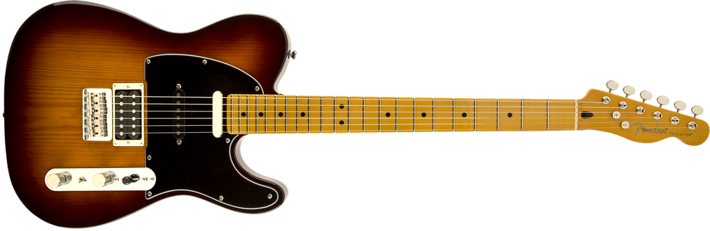

> Modern Player guitars deliver thoroughly modern features and
> distinctively unconventional takes on revered Fender instruments. The
> Modern Player Telecaster Plus is that rarest of birds---a three-pickup
> Tele® model, further distinguished by a pine body, Stratocaster®
> middle pickup, powerful humbucking bridge pickup, special switching
> and more. One of the most individual and tonally versatile Telecaster
> models Fender has ever offered.

*2013-11-09, Tom Lee Music, North Vancouver*

**Model Name:** Modern Player Telecaster® Plus, Maple Fingerboard, Honey
Burst\
**Model Number:** 0241102542\
**Series:** Modern Player\
**Color:** Honey Burst

**Body\
Body Material:** Pine\
**Body Finish:** Gloss Polyester\
**Body Shape:** Telecaster®

**Neck**\
**Neck Material:** 1-Piece Maple\
**Neck Finish:** Gloss Polyester\
**Neck Shape:** "C" Shape\
**Scale Length:** 25.5" (64.8 cm)\
**Fingerboard:** Maple\
**Fingerboard Radius:** 9.5" (241 mm)\
**Number of Frets:** 22\
**Fret Size:** Jumbo\
**String Nut:** Synthetic Bone\
**Nut Width:** 1.650" (42 mm)\
**Position Inlays:** Black Dots

**Electronics**\
**Bridge Pickup:** Modern Player Humbucking\
**Middle Pickup:** Modern Player Single-Coil Strat\
**Neck Pickup:** Modern Player Tele\
**Controls:** Master Volume, Master Tone\
**Pickup Switching:** 5-Position Blade: Position 1. Bridge Pickup,
Position 2. Bridge and Middle Pickup, Position 3. Middle Pickup,
Position 4. Middle and Neck Pickup, Position 5. Neck Pickup\
**Pickup Configuration:** HSS

**Hardware**\
**Bridge:** 6-Saddle Vintage-Style Strat® Strings-Through-Body Hardtail\
**Hardware Finish:** Nickel/Chrome\
**Tuning Machines:** Vintage-Style\
**Pickguard:** 3-Ply Black\
**Control Knobs:** Knurled Dome\
**Auxiliary Switching:** Mini-Toggle Rear Coil Selector Switch\
**Neck Plate:** 4-Bolt

**Miscellaneous** **Strings:** Fender® USA, NPS, (.009-.042 Gauges)

### Amp Settings

#### Fender Blues Jr. III

Volume: 3.5\
Fat: OFF\
Treble: 4.5\
Bass: 7.0\
Middle: 11.0\
Master: 4.0\
Reverb: 2.0

#### Joyo Tremolo

Intensity: 25%\
Rate: 25%

## Fender Mustang I v.2

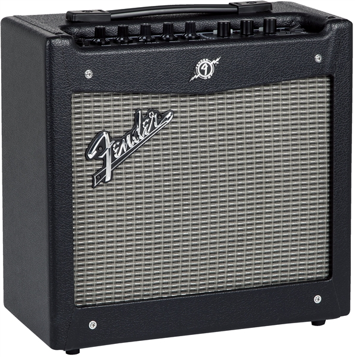

> The standard for modern guitar versatility and muscle. Mustang amps
> are incredible Fender tone machines for today's guitarists, driven by
> remarkably authentic amp models, a wealth of built-in effects and easy
> USB connectivity. And like no other amps, Mustang models make it easy
> to record, edit, store and share your music.
>
> Ideal for guitarists new to digital recording, the versatile Mustang I
> delivers an exciting ride for such a compact and easily portable
> design, with great tone from 20 watts of power, an 8" speaker and an
> astounding array of features.

*2013-11-09, Tom Lee Music, North Vancouver*

Electronics

Voltage: 120V\
Wattage: 20 Watts\
Controls: Gain, Volume, Treble, Bass, Master, Preset Select, Modulation
Select, Delay/Reverb Select, Save Button, Exit Button, Tap Tempo Button\
Channels: One\
Inputs: One - 1/4"

Hardware

Cabinet Material: 7-Ply 3/4" Medium-Density Fibreboard\
Amplifier Covering: Black Textured Vinyl\
Grille Cloth: Silver\
Amplifier Jewel: Red LED\
Front Panel: Black\
Handle: Molded Plastic Strap with Black Powder Coated Caps

Speakers

Speakers: One - 8" Fender® Special Design\
Speaker Wattage: 20 Watts\
Total Impedance: 8 ohms

Measurements

Amp Height: 14.5" (36.83 cm)\
Amp Width: 15.5" (40 cm)\
Amp Depth: 7.6" (19.3cm)\
Amp Weight: 17 lbs (7.7 kg)

## Art & Lutherie Parlor Guitar

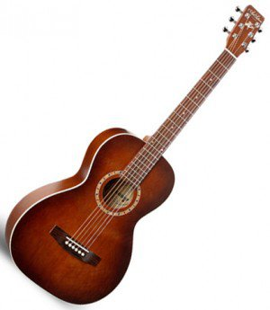

*2016-12-08, Tom Lee Music, North Vancouver*

- Body Type Ami
- Case Gig Bag
- Country of Origin Canada
- Electronics None
- Fingerboard Rosewood
- Finish Burgundy, Semi-Gloss Custom Varnish
- Neck Silver Leaf Maple
- Nut Graphtech Tusq
- Part \# 023523
- Pickguard None
- Saddle Graphtech Tusq
- Top/Body Material Spruce / Wild Cherry

## Fender Blues Jr III

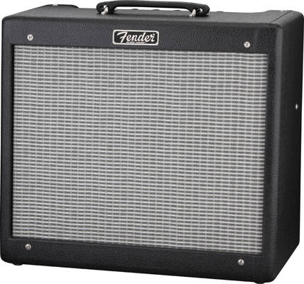

> Fender Hot Rod series amplifiers are found on every stage in the
> world, large and small, and are used by guitarists from all walks of
> life. Hot Rod amps deliver unmistakable Fender tone and are the
> perfect platform for musicians to craft their own signature sound.
> These no-frills amps are affordable, reliable and loud, and they pair
> extremely well with stomp boxes. The Blues Junior III is a 15-watt
> warm-toned, longtime favorite - the perfect grab-and-go tube amp for
> stage and studio. It is known for the fat mid tones characteristic of
> EL-84 output tubes, warm 12AX7 preamp tube overdrive, real spring
> reverb, simple control layout, footswitchable FAT boost and external
> speaker capability.

*2017-11-12, Best Buy, West Vancouver*

Features:\
Black control panel with front-reading text\
New badge\
Vintage Fender dog bone handle\
Vintage-size jewel light\
Sparkle circuit mod\
Rattle-reducing shock absorbers for the EL84 tubes\
Highly sensitive Fender Special Design 12 lightning bolt speaker by
Eminence\
Heavy-duty set-screw chicken head knobs.\
Electronics\
Voltage: 120V\
Wattage: 15 Watts\
Inputs: One\
Extension Speaker Jack: External Speaker Jack\
Channels: One Channel\
Rectifier: Solid State Rectifier\
Controls: Reverb, Master, Middle, Bass, Treble, "Fat" Switch, Volume

Hardware\
Hardware Finish: Chrome\
Pilot Light Jewel: Red Amp Jewel\
Handle: "Dog Bone" Handle\
Front Panel: Black Front Panel\
Grill Cover Cloth: Black Textured Vinyl Covering with Blackface Style
Black/Silver Grille Cloth\
Input Impedance: 1 M Input Impedance\
Output Impedance: 8 Ohm\
Amplifier Length: 9.18" (23.31 cm)\
Amplifier Width: 18" (45.72 cm)\
Amplifier Height: 16" (40.6 cm)\
Amplifier Weight: 31 lbs. (14.06 kg)\
Effects: Spring Reverb

Speakers\
Speaker: 12 inch, 8 ohm, 50 Watt Fender Lightning Bolt speaker by
Eminence

Tubes\
Pre Amp Tubes: 3 x 12AX7\
Power Tubes: 2 x EL84

Miscellaneous\
Unique Features: Black control panel, New badge, Rattle reducing shock
absorbers for EL84 tubes, Fat Switch

Accessories\
FootSwitch: Uses Optional 1-Button Footswitch, p/n 0994054000\
Knobs: Chicken head-style amp knobs

## Gibson Les Paul

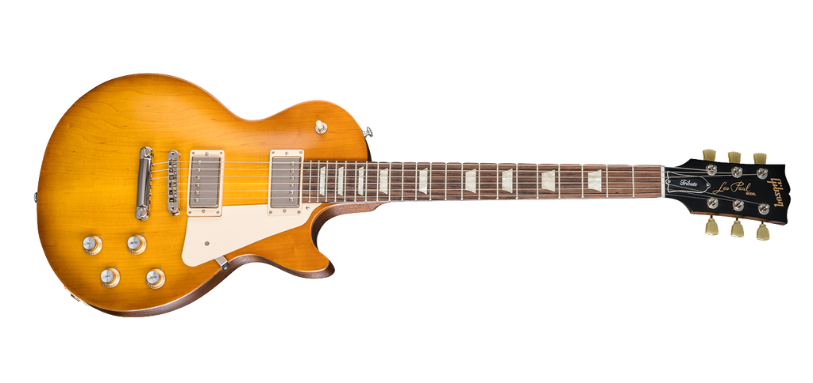

> The Les Paul Tribute captures the historic character of the legendary
> Les Paul guitar. Historic Gibson tonewoods, carved top, cream
> pickguard, vintage-style tuners, trapezoid inlays, and boosted
> PAF-inspired pickups give this impressive guitar classic looks and
> sound with an elegant, vintage touch. No weight relief for those
> players who like to feel the authenticity of history in their hands.

[Source](http://legacy.gibson.com/Products/Electric-Guitars/2018/USA/Les-Paul-Tribute-2018.aspx).

*2018-06-30, Tom Lee Music, North Vancouver*

**Body**

Wood Species: Plain Maple Top with a Mahogany Body

Finish: Satin Nitrocellulose Lacquer \| Satin Faded Honeyburst

**Neck**

Material: Mahogany

Neck Profile: Slim Taper

Scale Length: 24.75"

Fingerboard Material: Rosewood

Fingerboard Radius: 12"

Number of Frets: 22

Frets: Medium - Cryogenically Treated

Nut Material: Tektoid

Nut Width: 1.695"

End of Board Width: 2.26"

Inlays: Acrylic Trapezoids

**Hardware**

Finish: Nickel

Bridge: Aluminum Tune-O-Matic

Tailpiece: Aluminum Stop Bar

Tuning Machines: Vintage Style Keystones

Pick Guard: Cream

Control Knobs: Gold top hats with silver inserts and pointers

Switch Tip: Cream

Switch Washer: Cream (not mounted)

Jack Plate Cover: Cream

**Electronics**

Neck Pickup: 490R

Bridge Pickup: 498T

Controls: 2 volumes, 2 tones, 1 toggle switch

**Accessories**

Strings: .09, .011, .016, .026, .036, .046

Case: Soft Case

Other: Includes Gibson Accessory Kit

**SKUs**

LPTR18FHNH1, LPTR18SGNH1

### Amp Settings

#### Fender Blues Jr. III

Volume: 4.0\
Fat: OFF\
Treble: 5.0\
Bass: 7.0\
Middle: 5.0\
Master: 3.0\
Reverb: 3.0

#### Joyo Tremolo

Intensity: 25%\
Rate: 25%

## ZOOM Multi-FX Processor

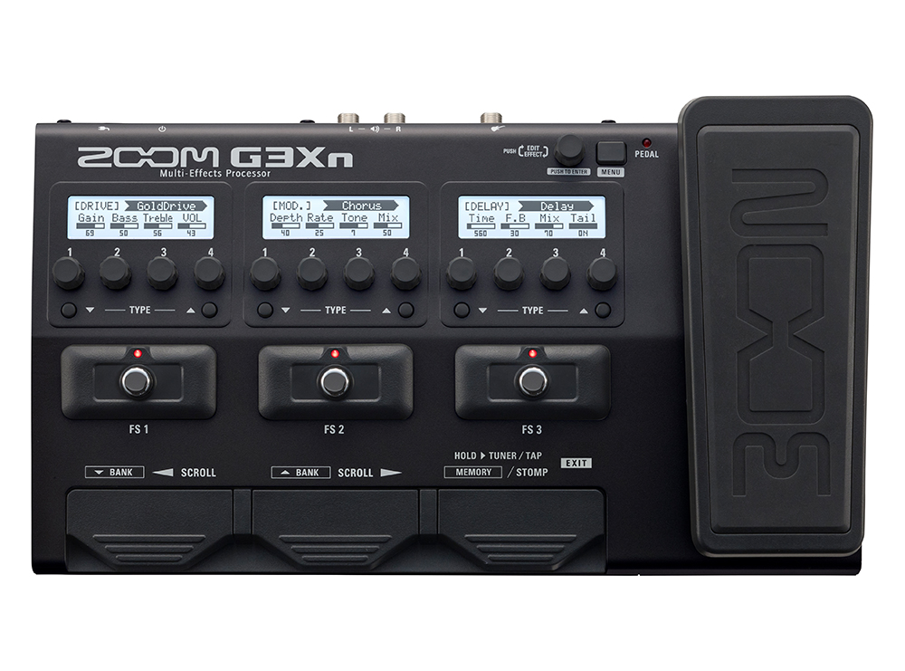{width="540"}

*2018-12-27, Long & McQuade, Richmond*

**Features At A Glance**

- 70 (68 effects, 1 looper pedal, and 1 rhythm pedal) onboard
  high-quality digital effects, including distortion, overdrive, EQ,
  compression, delay, reverb, flanging, phasing, and chorusing
- 5 new amp emulators plus 5 cabinet emulators
- 75 custom-designed factory patches
- Free ZOOM Guitar Lab Mac/Windows software allows\
  downloading of additional effects and patches
- Use up to 7 effects simultaneously, chained together in\
  any order
- 3 stompbox switches allow effects to instantly be brought in and out
- 3 independent editing displays
- Auto Save function for automatic saving of all patch parameters
- Onboard chromatic tuner with dedicated footswitch supports all
  standard guitar tunings, including open and drop tunings
- Tuner range of 435 - 445 Hz
- Stereo/mono Looper allows recording of up to 80 seconds of phrase
  recording
- 68 built-in rhythm patterns that can be used in conjunction with the
  Looper
- Tap Tempo with dedicated footswitch
- Input jack accepts standard guitar cable
- Auxiliary stereo input jack for connection of smartphones and music
  players
- Dual output jacks for connection to guitar amps and mono or stereo PA
  systems
- Stereo headphone output
- Included AC adapter

### Download Manuals

- [Guitar Lab](E_GuitarLab_v7.0.pdf)
- [Operation Manual](E_G3n_G3Xn.pdf)
- [Patch List](E_G3Xn_patch-list.pdf)
- [Parameters](E_G5n_G3n_G3Xn_FX_Parameters.pdf)
- [Power Chart](E_G5n_G3n_G3Xn_PowerChart_v2.pdf)

## Fender Stratocaster

> A tonally versatile guitar with time-honored Fender style and sound,
> the Deluxe Strat has a few tricks up its sleeve. Special switching
> unlocks extra pickup combinations for those moments you find yourself
> needing a little extra kick to stand out. Combining noise-free
> performance with enhanced playing comfort, this sleek instrument is a
> truly deluxe performer that excels on stage and in the studio.

*2019-07-09, Tom Lee Music, Vancouver*

**Model Name:** Stratocaster Deluxe Strat®\
**Model Number:** 0147103303\
**Series:** Deluxe Strat®\
**Color:** 2-Color Sunburst

**Body**

**Body Material:** Ash\
**Body Finish:** Gloss Polyester\
**Body Shape:** Stratocaster®

**Neck**

**Neck Material:** Maple\
**Neck Finish:** Satin Urethane\
**Neck Shape:** Modern "C"\
**Scale Length:** 25.5" (648 mm)\
**Fingerboard Material:** Pau Ferro\
**Fingerboard Radius:** 12" (305 mm)\
**Number of Frets:** 22\
**Fret Size:** Narrow Tall\
**Nut Material:** Synthetic Bone\
**Nut Width:** 1.650" (42 mm)\
**Position Inlays:** White Pearloid Dots\
**Truss Rod:** Standard\
**Truss Rod Nut:** 3/16" Hex Adjustment

**Electronics**

**Bridge Pickup:** Vintage Noiseless™ Single-Coil Strat®\
**Middle Pickup:** Vintage Noiseless™ Single-Coil Strat®\
**Neck Pickup:** Vintage Noiseless™ Single-Coil Strat®\
**Controls:** Master Volume, Tone 1. (Neck/Middle Pickups), Tone 2.
(Bridge Pickup)\
**Switching:** 5-Position Blade: Position 1. Bridge, Position 2. Bridge
and Middle, Position 3. Middle, Position 4. Middle and Neck (Plus Bridge
When Push/Push Switch Is Activated), Position 5. Neck (Plus Bridge When
Push/Push Switch Is Activated)\
**Configuration:** SSS

**Hardware**

**Bridge:** 2-Point Synchronized Tremolo with Bent Steel Saddles\
**Hardware Finish:** Nickel/Chrome\
**Tuning Machines:** Deluxe Cast/Sealed Locking with Vintage Style
Button\
**Pickguard:** 3-Ply Black\
**Control Knobs:** Aged White Plastic\
**Switch Tip:** Aged White\
**Neck Plate:** 4-Bolt Asymmetrical

**Miscellaneous**

**Strings:** Fender® USA 250L Nickel Plated Steel (.009-.042 Gauges)

**Accessories**

**Case/Gig Bag:** Deluxe Gig Bag

### Amp Settings

#### Fender Blues Jr. III

Volume: 3.5\
Fat: OFF\
Treble: 4.5\
Bass: 7.0\
Middle: 11.0\
Master: 4.0\
Reverb: 2.0

#### Joyo Tremolo

Intensity: 25%\
Rate: 25%

## Fender Jaguar

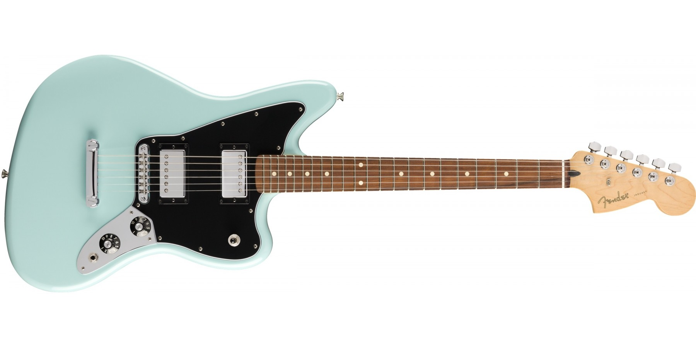

> Respecting their heritage while offering a modern twist on a classic,
> Fender's Player Series Jaguar updates the popular short-scale
> instrument with modern features and pickups. Starting with the surf,
> indie rock and punk favorite's iconic offset body and easy-playing 24"
> scale length, Fender fines the design with freshly designed Player
> Series pickups, for an exceptional range of available tones. The maple
> neck now boasts a contemporary 9.5" radius pau ferro fingerboard, and
> the Adjusto-matic bridge and anchored tailpiece offers stable tuning
> and rock-solid intonation. Always a guitar for the musically
> adventurous, the Player Series Jaguar is ready for you to create
> whatever music floats into your head.

[Source](https://www.musiciansfriend.com/guitars/fender-player-jaguar-hh-pau-ferro-fingerboard-limited-edition-electric-guitar).

*2020-11-07, Long & McQuade, Surrey*

**Model Name:** Jaguar\
**Model Number:** 014-0223-504\
**Series:** FSR Player\
**Color:** Daphne Blue

**Body**

**Shape:** Jaguar® (Double cutaway offset)\
**Type:** Solid body\
**Material:** Alder\
**Finish:** Gloss Polyester\
**Pickguard:** 3-Ply Black

**Neck**

**Shape:** Modern C\
**Wood:** Maple\
**Joint:** 4-Bolt with "F" Logo\
**Scale length:** 24 in. (610 mm)\
**Truss rod:** Standard, 3/16" Hex Adjustment\
**Finish:** Satin Urethane Finish on Back of Neck with Gloss Urethane
Headstock Face

**Fingerboard**

**Material:** Pau Ferro\
**Radius:** 9.5 in.\
**Fret size:** Medium jumbo\
**Number of frets:** 22\
**Inlays:** Dot\
**Nut width/material:** 1.65 in. (42 mm) Synthetic Bone

**Pickups**

**Configuration:** HH\
**Neck:** Player Series Alnico 2 Humbucking\
**Bridge:** Player Series Alnico 2 Humbucking

**Controls**\
**Control layout:** Master volume, Master tone\
**Control knobs:** Skirted Amp Knobs\
**Pickup switch:** 3-Position Blade: Position 1. Bridge Pickup, Position
2. Bridge and Neck Pickups, Position 3. Neck Pickup

**Hardware**

**Bridge type:** Fixed\
**Bridge design:** Adjusto-matic\
**Tailpiece:** Stopbar\
**Tuning machines:** Die-cast sealed\
**Color:** Nickel/chrome

**Miscellaneous**

**Strings:** Nickel Plated Steel (.009-.042 Gauges)

## Fender Telecaster

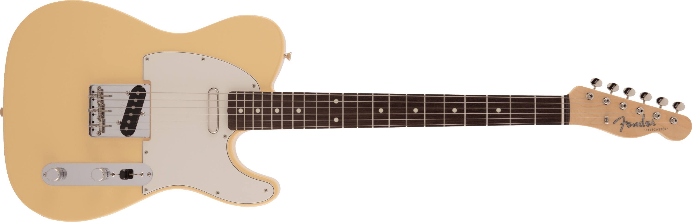

> The Made in Japan Traditional series was derived by combining the
> aesthetics of Fender's traditional musical instrument production with
> sophisticated Japanese craftsmanship. The orthodox DNA of the Fender
> is revived with a solid Made in Japan quality.
>
> Made in Japan Traditional 60s Telecaster® uses a basswood body with a
> gloss finish. The 9.5-inch radius "U"-shaped maple neck equipped with
> 21 vintage-style frets provides a classic playability unique to the
> Traditional series. Vintage style Tele® bridge with three threaded
> steel saddles, and the original pick-up selected for the Traditional
> series play a realistic and musical vintage tone. The narrow nut width
> is easy for Japanese players to play.

[Source](https://jp.fender.com/products/made-in-japan-traditional-60s-telecaster)

*2025-10-10, Fender Flagship Tokyo, Harajuku*

**Product Name:** Made in Japan Traditional 60s Telecaster®, Rosewood
Fingerboard\
**Model Number:** 5360200341\
**Series:** Made in Japan Traditional\
**Color:** Vintage White

**Body**\
**Body Material:** Basswood\
**Body Finish:** Gloss Polyester\
**Body Shape:** Telecaster®

**Neck**\
**Neck Material:** Maple\
**Neck Finish:** Gloss Urethane\
**Neck Shape:** "U" Shape\
**Scale Length:** 25.5" (64.77 cm)\
**Fingerboard:** Rosewood\
**Fingerboard Radius:** 9.5" (241 mm)\
**Number of Frets:** 21\
**Fret Size:** Vintage\
**String Nut:** Bone\
**Nut Width:** 1.615" (41.02 mm)\
**Position Inlays:** White Dots

**Electronics**\
**Bridge Pickup:** Vintage-Style Single-Coil Tele®\
**Neck Pickup:** Vintage-Style Single-Coil Tele®\
**Controls:** Master Volume, Master Tone\
**Pickup Switching:** 3-Position Blade: Position 1. Bridge Pickup,
Position 2. Bridge and Neck Pickups, Position 3. Neck Pickup\
**Pickup Configuration:** SS

**Hardware**\
**Bridge:** 3-Saddle Vintage Style Tele® with Threaded Steel Saddles\
**Hardware Finish:** Nickel/Chrome\
**Tuning Machines:** Vintage-Style\
**Pickguard:** 3-Ply Mint Green\
**Control Knobs:** Knurled Flat-Top\
**Neck Plate:** 4-Bolt\
**Strings:** Nickel Plated Steel (.009–.042 Gauges)

**Miscellaneous** Included: Gig Bag

### Amp Settings

#### Fender Blues Jr. III

Volume: 3.5\
Fat: OFF\
Treble: 4.5\
Bass: 7.0\
Middle: 5.0\
Master: 3.5\
Reverb: 2.0

#### Joyo Tremolo

Intensity: 25%\
Rate: 50%

## JOYO JF-09 TREMOLO

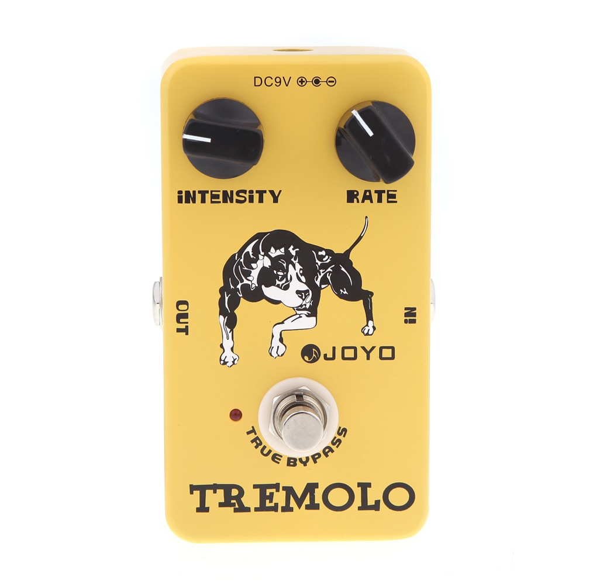{width="246"}

This is the tremolo of the beloved classic tube amplifiers--using the
same photoelectric tube circuitry as the trem in those amps of old.
Intensity and Rate knobs make it easy to adjust the tone and vibe. True
bypass design minimizes tone loss. Aluminum alloy casing with stoving
varnish finish.

## Blue Yeti

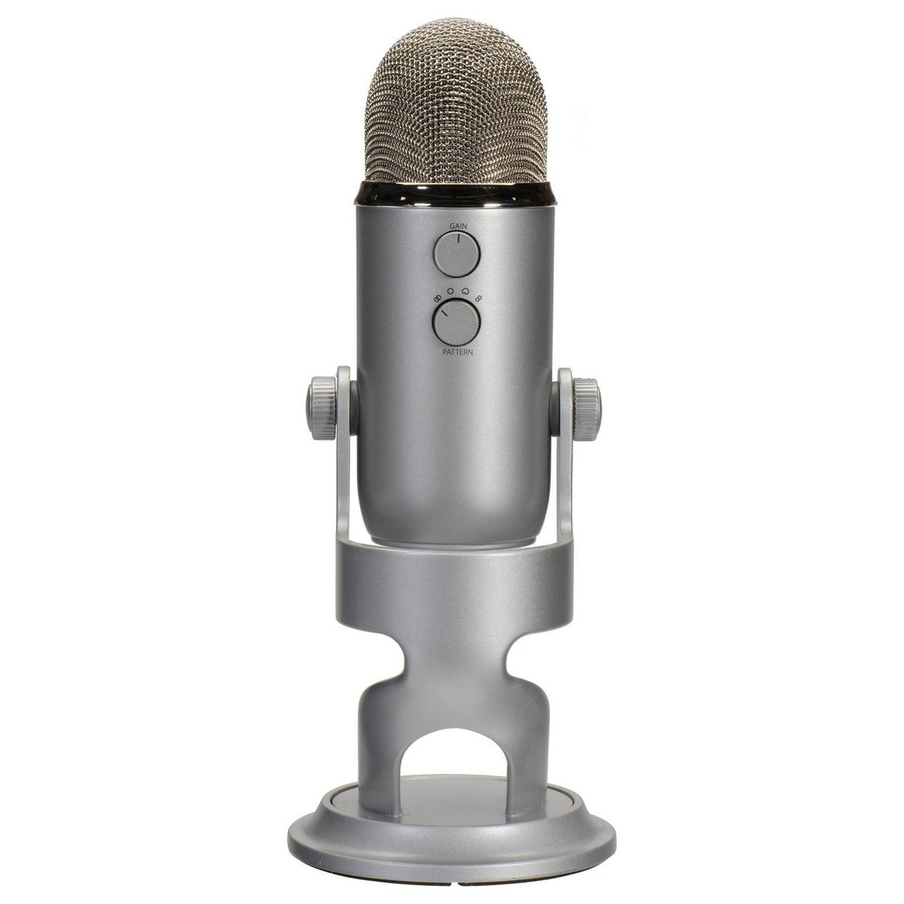{fig-align="center" width="388"}

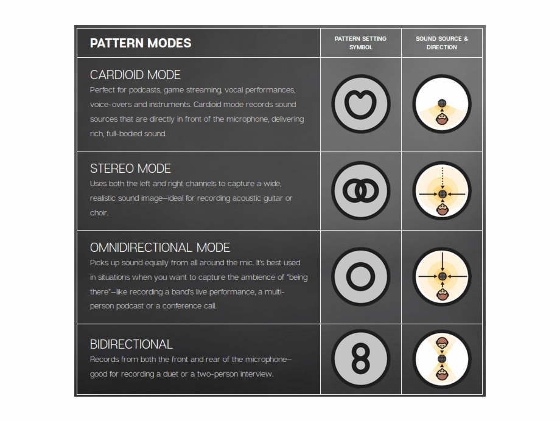{fig-align="center" width="602"}

Power Required/Consumption: 5V 150mA\
Sample Rate: 48 kHz Bit Rate: 16-bit\
Capsules: 3 Blue-proprietary 14mm condenser capsules\
Polar Patterns: Cardioid, Bidirectional, Omnidirectional, Stereo\
Frequency Response: 20Hz - 20kHz Max\
Dimensions (extended in stand): 4.72" (12cm) x 4.92"(12.5cm) x
11.61"(29.5cm)\
Weight (microphone): 1.2 lbs (.55 kg)\
Weight (stand): 2.2 lbs (1 kg)\
Headphone Amplifier\
Impedance: 16 ohms\
Power Output (RMS): 130 mW\
THD: 0.009%\
Frequency Response: 15 Hz - 22 kHz\
Signal to Noise: 100dB

## Mac Studio

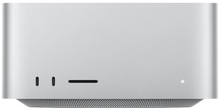

**Apple M1 Max chip**

- 10-core CPU with 8 performance cores and 2 efficiency cores
- 24-core GPU
- 16-core Neural Engine
- 400GB/s memory bandwidth

**Media engine**

- Hardware-accelerated H.264, HEVC, ProRes and ProRes RAW
- Video decode engine
- Two video encode engines
- Two ProRes encode and decode engines

**Memory**

32GB unified memory

**Storage**

512GB SSD

**Video Support**

Thunderbolt 4 digital video output supports

- Native DisplayPort output over USB‑C
- Thunderbolt 2, DVI and VGA output supported using adapters (sold
  separately)

HDMI display video output

- Support for one display with up to 4K resolution at 60Hz
- DVI output using HDMI to DVI Adapter (sold separately)

**Audio**

- Built-in speaker
- 3.5 mm headphone jack with advanced support for high-impedance
  headphones
- HDMI port supports multichannel audio output

**Connections**

Four Thunderbolt 4 ports with support for:

- Thunderbolt 4 (up to 40Gb/s)

- DisplayPort

- USB 4 (up to 40Gb/s)

- USB 3.1 Gen 2 (up to 10Gb/s)

- Two USB-A ports (up to 5Gb/s)

- HDMI port

- 10Gb Ethernet

- 3.5 mm headphone jack

On front (M1 Max):

- Two USB‑C ports (up to 10Gb/s)
- SDXC card slot (UHS-II)

**Communications**

Wi-Fi

- 802.11ax Wi-Fi 6 wireless networking
- IEEE 802.11a/b/g/n/ac compatible

Bluetooth

- Bluetooth 5.0 wireless technology

Ethernet

- 10Gb Ethernet (Nbase-T Ethernet with support for 1Gb, 2.5Gb, 5Gb and
  10Gb Ethernet using RJ-45 connector)

## Studio Display

**5K Retina display**

- 27-inch (diagonal) 5K Retina display
- 5120-by-2880 resolution at 218 pixels per inch
- 600 nits brightness
- Support for 1 billion colours
- Wide colour (P3)
- True Tone technology

**Camera**

- 12MP Ultra Wide camera with 122° field of view
- ƒ/2.4 aperture
- Center Stage

**Audio**

- High-fidelity six-speaker system with force-cancelling woofers
- Wide stereo sound
- Support for Spatial Audio when playing music or video with Dolby Atmos
- Studio-quality three-mic array with high signal-to-noise ratio and
  directional beamforming
- Support for "Hey Siri"

**Connections**

One Thunderbolt 3 (USB-C) port, three USB-C ports

- One upstream Thunderbolt 3 (USB-C) port for host (with 96W host
  charging)
- Three downstream USB-C ports (up to 10Gb/s) for connecting
  peripherals, storage and networking

## Photos

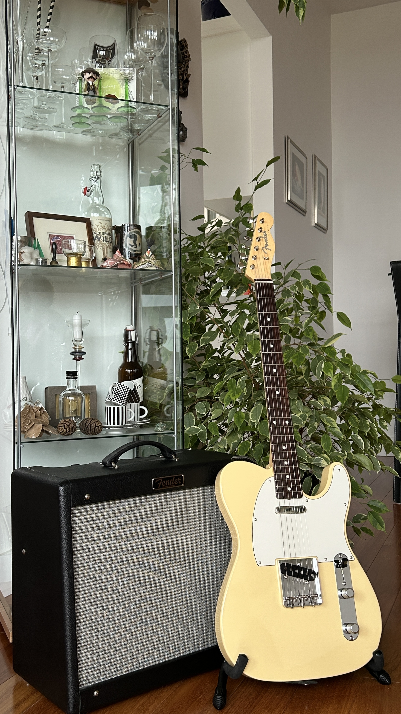{group="pix"}

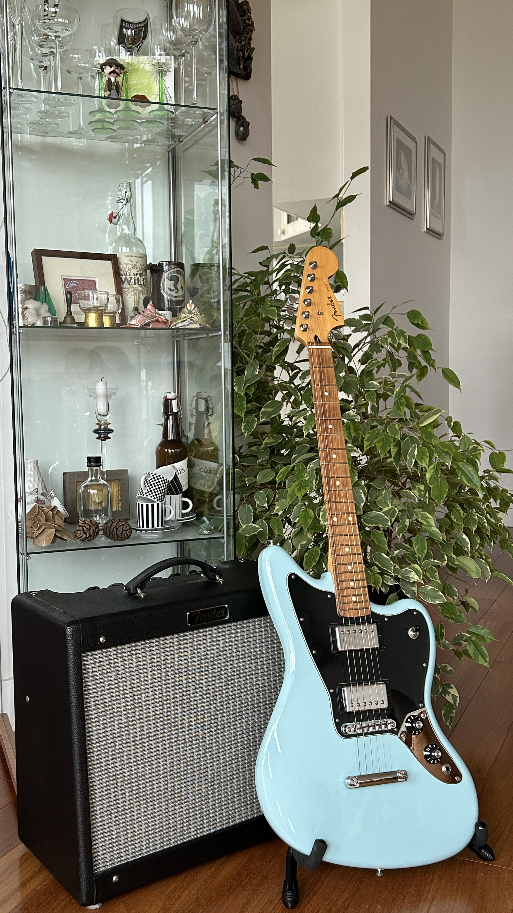{group="pix"}

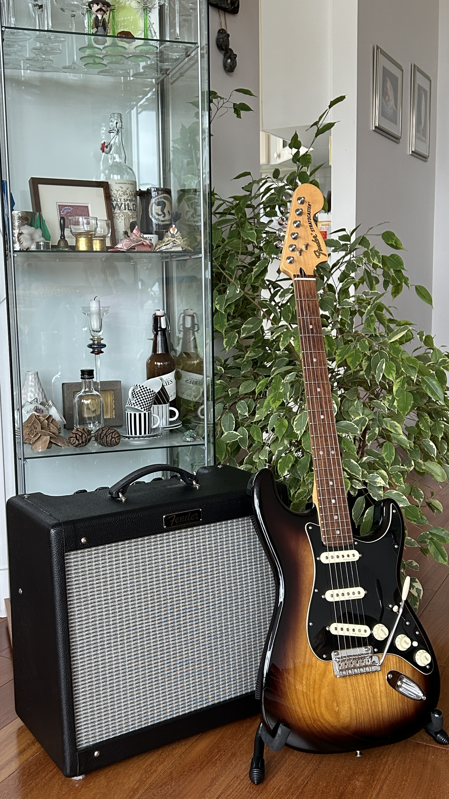{group="pix"}

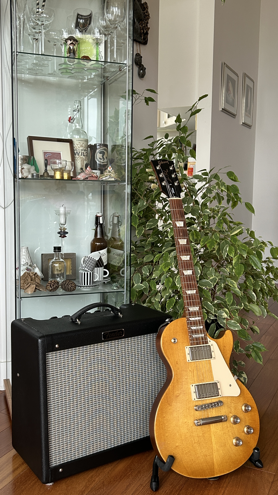{group="pix"}

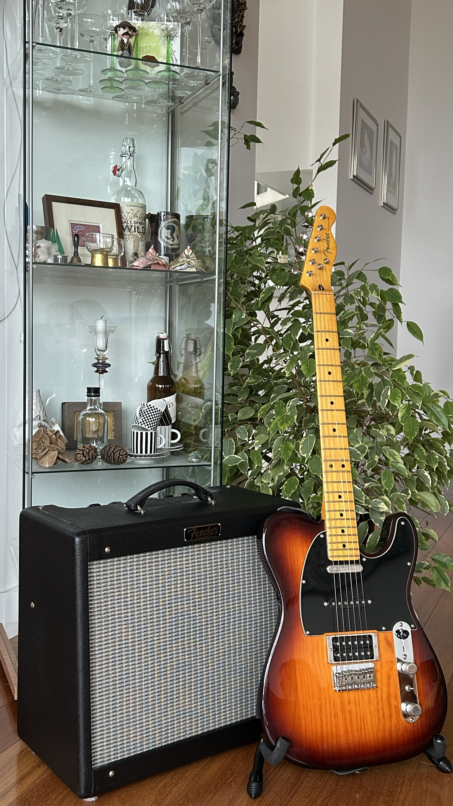{group="pix"}